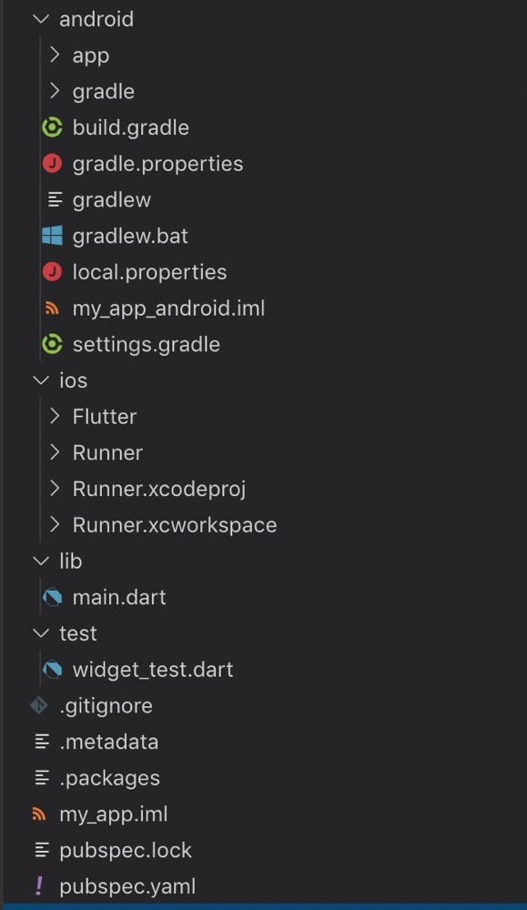

### Flutter项目结构

#### 1、创建项目

* flutter create my_app

#### 2、运行项目前，先启动模拟器

* 查看可以运行的模拟器
  
  * flutter emulators
    
    
  
* 启动模拟器命令

  > apple_ios_simulator • iOS Simulator • Apple • ios 具体模拟器

  * flutter emulators --launch apple_ios_simulator • iOS Simulator • Apple • ios

#### 3、启动项目

  * fluttr run

    

####  4、项目结构

